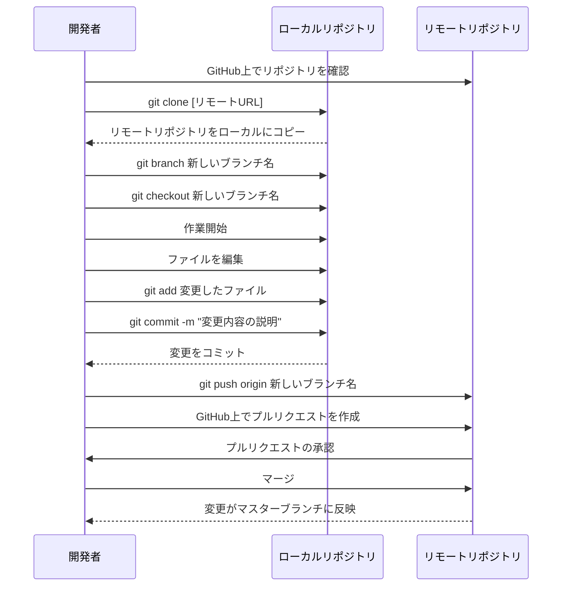

# 2024-09-21-AWSなんてこわくないもん！2nd Season

## [Mermaid](https://mermaid.js.org/) Diagram Example



## dockerの起動

1. [colima](https://github.com/abiosoft/colima)でdockerを起動

```shell
colima start
```

dockerのステータス確認

```shell
colima status
```

## アプリケーションの起動

````shell
```shell
docker-compose up -d
````

## dockerのサーバーに入る

```shell
docker exec -it djangoajust-web-1 bash
```

root@d579a2142892:/app#と表示されればOK

## コンテナの状態確認

```shell
docker ps -a
# または
docker container ls -a
```

## 選択したコンテナを削除

```shell
docker ps -a | awk '{print $1}' | fzf | xargs docker rm
```
