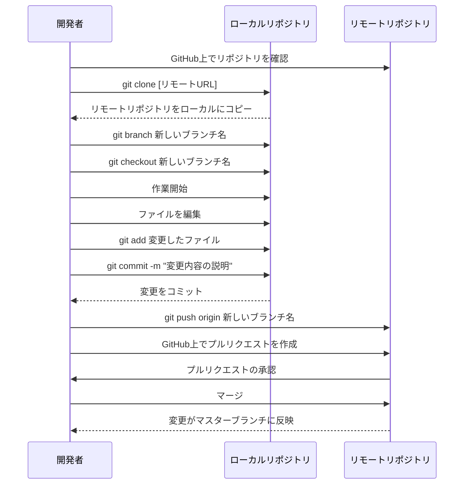

# 2024-09-21-AWSなんてこわくないもん！2nd Season

## [Mermaid](https://mermaid.js.org/) Diagram Example



## Docker

### dockerの起動

1. [colima](https://github.com/abiosoft/colima)でdockerを起動

```shell
colima start
```

dockerのステータス確認

```shell
colima status
```

### アプリケーションの起動

````shell
```shell
docker-compose up -d
````

### dockerのサーバーに入る

#### web

```shell
docker exec -it djangoajust-web-1 bash
```

root@d579a2142892:/app#と表示されればOK

#### db

```shell
docker exec -it djangoajust-db-1 bash
psql -U user -d dbs
# DBの内容を確認
\dt
```

### コンテナの状態確認

```shell
docker ps -a
# または
docker container ls -a
```

### 選択したコンテナを削除

```shell
docker ps -a | awk '{print $1}' | fzf | xargs docker rm
```

## Ajustアプリケーションのインストール手順

1. 必要なパッケージのインストール

```shell
pip install django psycopg2-binary
```

2. プロジェクトの作成

```shell
django-admin startproject ajust_pj
cd ajust_pj
```

3. アプリケーションの作成

```shell
python manage.py startapp ajust_app
```

4. settings.pyの編集

- INSTALLED_APPS に 'ajust_app' を追加
- DATABASES の設定を以下のように変更

```python settings.py
DATABASES = {
    'default': {
        'ENGINE': 'django.db.backends.postgresql',
        'NAME': 'dbs',
        'USER': 'user',
        'PASSWORD': 'password',
        'HOST': 'db',
        'PORT': '5432',
    }
}
```

5. モデルの作成とマイグレーション

```shell
python manage.py makemigrations ajust_app
python manage.py migrate
```

6. Docker Compose でアプリケーションを起動

```shell
docker-compose up --build
```

7. ブラウザで <http://localhost:8000> にアクセスしてアプリケーションを使用開始
